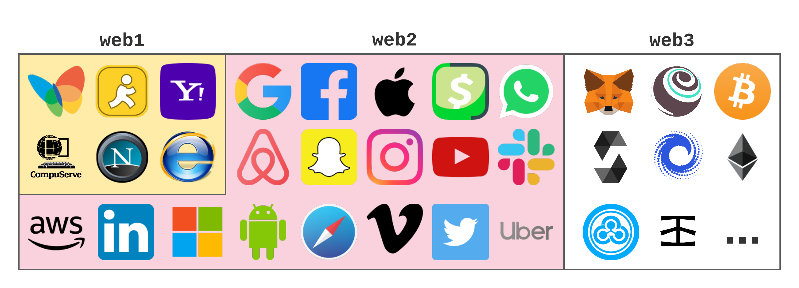

<h2>WEB3.0</h2>

Web 3 or Web 3.0, is based on the concept of creating a totally decentralized ecosystem. This new technological dimension believes in 
leveraging the power of A.I., machine learning, and the latest technologies like blockchain to solve the problems of the present-day 
internet/online ecosystem. Some key features of web3.0 are as following:

<ul>
  <li>Intelligent, web-based functionalities and applications</li>
  <li>Decentralized processes</li>
  <li>A fusion of Web technology and Knowledge Representation</li>
  <li>Behavioral advertising and engagement</li>
  <li>Edge computing</li>
  <li>Live videos</li>
  <li>The Internet of Things (IoT)</li>
  <li>Semantic searches</li>
  <li>Read, Write, and Control Web</li>
 </ul>
  
<h2>WEB2.0</h2>

 Web 2.0 are websites and applications that make use of user-generated content for end-users. Web 2.0 is characterized by greater user interactivity and collaboration, more pervasive network connectivity and enhanced communication channels. The term was coined by Darcy DiNucci in 1999 and later popularized by Tim O'Reilly and Dale Dougherty at the first Web 2.0 Conference in late 2004.

<ul>
  <li>Improved user interaction over Web 1.0</li>
  <li>Web applications introduced</li>
  <li>Functions such as online documents, video streaming, etc.</li>
  <li>Everything moves online; information and apps are stored on servers</li>
  <li>Interactive advertising and pay-per-click</li>
  <li>Cloud computing operations</li>
  <li>Centralized data</li>
  <li>Read and Write Web</li>
  </ul>

<h2>WEB1.0</h2>

Web 1.0 is the term used for the earliest version of the Internet as it emerged from its origins with Defense Advanced Research Projects Agency (DARPA) and became, for the first time, a global network representing the future of digital communications.

<ul>
<li>No user-to-server communication</li>
<li>Static websites</li>
<li>Content browsing only</li>
<li>Hyper-linking and bookmarking pages</li>
<li>Read-only Web</li>
  </ul>
  
# HAPPY LEARNING🎉
