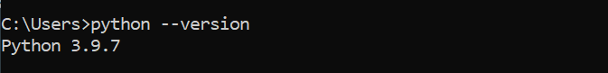
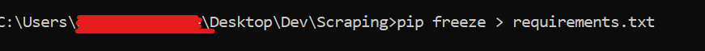
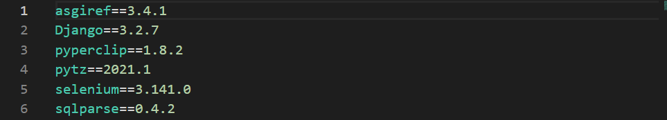

# Deploy a standalone python script in Heroku

## All files required for deploying python script on Heroku:

- Procfile 
- runtime.txt
- requirements.txt
- Python file
  

### Procfile

This is the most important file in Heroku.
This is the first thing that Heroku looks for.

Remember do not add any extension to this filename like Procfile.txt It should be compulsorily be Procfile with no extension and change in name.
This contains the worker.
A worker is a small command which tells Heroku which types of file are you running. By default Heroku considers it as a web app. So to change it you have to type worker followed by the command to run the python file.

For example -

worker : python <your_file_name>.py

  

### runtime.txt

This will have the python version

There are two ways to find your python version.

- Simply go to the terminal/command prompt/powershell and type "python --version" and you will get the version. Simply copy it and paste it in runtime.txt

But if your path is not set in the environment variable follow the second way.
 

- Make a new python file and type the following:

        #Python3

        import sys
        print(sys.version)

  

This way we will get the python version. Copy the version and paste in the following way to the runtime.txt. The file look something like this.

 
 

### requirements.txt

All the required packages in your python script

Requirements.txt file contains all the file that are installed by you to work in your python script.

There are two ways to get all the packages that you have used to get into the requirements.txt file.

- First is the manual approach . Open your python script and see what packages have you imported. If any of the imported packages are installed by you to work specifically for this project. Simply copy these packages and paste all of them in a new line. You need not include packages like os, sys, time into your requirements.txt file because these packages come by default with python and will be downloaded by Heroku when it installs python.
Heroku recommends giving version name with your package name but it is not compulsory.

You can find the version of your package by typing in the following code in a python file:

    #Python3

    import pyperclip
    print(pyperclip.__version__)

Simply do this for every package in your python script and write it in the following way to the requirements.txt file.

<package_name>==<package_version>

For example:

    pyperclip==1.8.2

- Second approach is a simple line which types for you all your installed packages with there versions into the requirements.txt

One disadvantage of this approach is that if you are not working on a virtual environment then this line will include all the packages that are installed by you in python irrespective of the fact whether it was used by you in that file or not. 

This will lead to Heroku installing packages which you never used. Recommended not using this approach if you are not using a virtual environment.

Below is an example how your requirements.txt file should like

  

### Python Script 

Before pushing your code into deployment into the Heroku make sure your script runs for every input and doesnt crash. If your code uses APIs then hide it with .env files. I will cover it in some other article.
  
### Deploying in Heroku

Make an account in Heroku and after successful registration make a new app. Push your code by following instructions on screen through Github or directly into Heroku.

After having successfully pushed your code you will see with multiple tabs like Overview,  Deploy , Resources and 3 others. Go to Overview and you will see the dynos section. Click on Configure Dynos. You will be taken to a screen where you will see your own dyno - worker ( worker : python <filename>.py ) . Edit this and enable it. This will switch the dyno on and your python script will now be deployed. 

You can refer to my project for any problems:

 https://github.com/divyamJi06/InstaDP

To run my python script simply go to Telegram and search for @insta_D_P_bot . This Telegram bot gives you the profile picture of any username that you type.
  
### Projects that you can do with python and deploy them:

- Make a twitter bot which sends you a message on Telegram whenever Elon Musk tweets anything.
- Get some random task done at a particular time.
- Make telegram bots and send some inputs to your script and do some task.